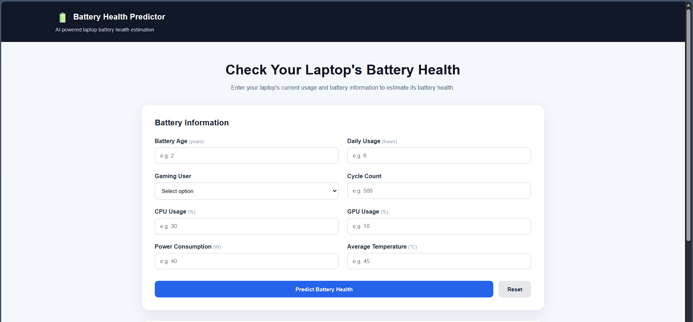
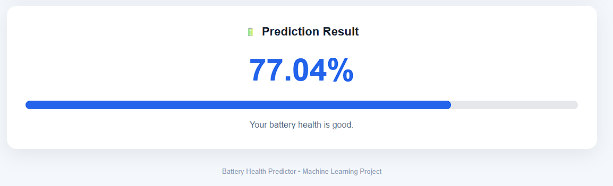

# Laptop Battery Health Predictor

> An end-to-end Machine Learning web application for predicting laptop battery health from battery and system usage characteristics.

## Live Demo

**Live Application:**
https://batteryhealth.onrender.com/

---
## Screenshots

### Home Page



### Prediction Result



---
## Overview

Laptop batteries gradually lose their ability to hold charge due to factors such as battery age, charge cycles, usage patterns, system workload, temperature, and power consumption.

This project uses Machine Learning regression models to estimate laptop battery health based on these characteristics.

The trained model is integrated into a Flask web application, allowing users to enter laptop and battery-related information and receive a predicted battery health value through an interactive web interface.

---

## Features

* Machine Learning-based battery health prediction
* Data preprocessing and feature analysis
* Feature selection
* Multiple regression model approaches
* Interactive Flask web application
* Real-time prediction
* Serialized Machine Learning model using Joblib
* Responsive web interface
* Public deployment using Render

---

## Machine Learning Pipeline

```text
Raw Dataset
     |
     v
Data Cleaning
     |
     v
Exploratory Data Analysis
     |
     v
Feature Analysis
     |
     v
Train / Test Split
     |
     v
Preprocessing and Scaling
     |
     v
Feature Selection
     |
     +-------------------+
     |                   |
     v                   v
  Model A             Model B
     |                   |
     +---------+---------+
               |
               v
        Model Evaluation
               |
               v
        Best Model Selection
               |
               v
        Model Serialization
               |
               v
          Flask Web App
               |
               v
             Render
```

---

## Input Features

The predictor uses battery and system characteristics such as:

| Feature              | Description                        |
| -------------------- | ---------------------------------- |
| Battery Age          | Age of the laptop battery          |
| Daily Usage Hours    | Average daily laptop usage         |
| Gaming User          | Indicates gaming-oriented usage    |
| Design Capacity      | Original battery capacity          |
| Cycle Count          | Number of charge/discharge cycles  |
| CPU Usage            | Average CPU utilization            |
| GPU Usage            | Average GPU utilization            |
| Power Consumption    | Estimated system power consumption |
| Average Temperature  | Average operating temperature      |
| Full Charge Capacity | Current maximum battery capacity   |

The exact features used by each model may differ because one model uses the complete feature set while another uses selected important features.

---

## Machine Learning Models

Two model approaches were developed.

### Model A — Full Feature Model

This model uses the complete set of available input features.

### Model B — Feature-Selected Model

This model uses a reduced set of important features identified through feature analysis and selection.

The two approaches allow comparison between a model using the complete feature set and a model using a more focused group of predictors.

---

## Model Evaluation

Battery health is a continuous numerical target, making this a regression problem.

The models are evaluated using regression metrics including:

* R² Score
* Mean Absolute Error (MAE)
* Mean Squared Error (MSE)
* Root Mean Squared Error (RMSE)

R² is used to evaluate how well the model explains the variation in the target variable.

---

## Web Application

The trained Machine Learning model is integrated into a Flask web application.

The prediction workflow is:

```text
User Input
    |
    v
Flask Application
    |
    v
Input Processing
    |
    v
Trained ML Model
    |
    v
Prediction
    |
    v
Result Display
```

Users can enter the required laptop and battery characteristics and receive the predicted battery health directly through the web interface.

---

## Project Structure

```text
laptop-battery-health-predictor/
|
├── app.py
├── requirements.txt
├── Procfile
|
├── model/
│   └── best-model.pkl
|
├── src/
│   └── predict.py
|
├── templates/
│   └── index.html
|
├── static/
│   ├── css/
│   │   └── style.css
│   └── js/
│       └── script.js
|
└── README.md
```

---

## Technologies Used

### Programming Language

* Python

### Data Science and Machine Learning

* Pandas
* NumPy
* Scikit-learn
* Joblib

### Web Development

* Flask
* HTML
* CSS
* JavaScript

### Deployment and Version Control

* Git
* GitHub
* Render

---

## Installation

### 1. Clone the repository

```bash
git clone https://github.com/YOUR-USERNAME/laptop-battery-health-predictor.git
```

### 2. Navigate to the project directory

```bash
cd laptop-battery-health-predictor
```

### 3. Create a virtual environment

```bash
python -m venv venv
```

### 4. Activate the virtual environment

On Windows:

```bash
venv\Scripts\activate
```

On macOS/Linux:

```bash
source venv/bin/activate
```

### 5. Install dependencies

```bash
pip install -r requirements.txt
```

### 6. Run the application

```bash
python app.py
```

The application will be available at the local address displayed by Flask.

---

## Deployment

The application is deployed using Render.

The production server uses Gunicorn:

```bash
gunicorn app:app
```

Dependencies are installed using:

```bash
pip install -r requirements.txt
```

The deployed application is available at:

https://batteryhealth.onrender.com/

The free Render instance may become inactive after a period without requests. The first request after inactivity may therefore take longer while the application starts again.

---

## Model Serialization

The trained Machine Learning model is serialized using Joblib.

```python
joblib.dump(model, "model/best-model.pkl")
```

The Flask application loads the model using a project-relative path. This allows the application to work across different environments instead of relying on a machine-specific file path.

---

## Learning Outcomes

This project provided practical experience with:

* Data cleaning
* Exploratory Data Analysis
* Feature engineering
* Feature selection
* Data preprocessing
* Feature scaling
* Train/test splitting
* Regression
* Model evaluation
* Model serialization
* Flask application development
* Frontend and backend integration
* Git and GitHub
* Production deployment
* Deployment debugging

---

## Future Improvements

Potential improvements include:

* Adding additional Machine Learning models
* Hyperparameter optimization
* Model performance comparison
* Battery health visualization
* Historical prediction tracking
* Improved mobile responsiveness
* User authentication
* Prediction history
* Dedicated prediction API
* Additional battery-related features

---

## Author

**Shuvam Chatterjee**

Machine Learning | Data Science | Python

---

## License

This project is licensed under the MIT License.
